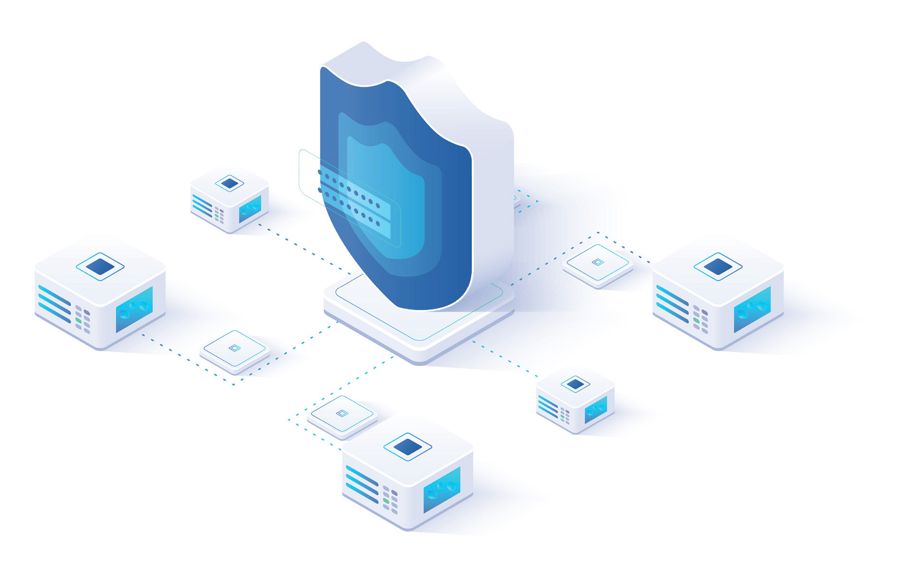

================================================================================
2. Il Cloud Computing
================================================================================

Il Cloud Computing, nel seguito Cloud, è un nuovo paradigma di utilizzo
e gestione di risorse computazionali e di servizi informatici erogati su
richiesta tramite internet. I servizi Cloud sono offerti mediante
cataloghi standardizzati idonei a garantire, in modo sistematico e
semplificato (*agilità*), l’attivazione dei servizi che possono scalare,
a seconda dei picchi di carico, con modalità trasparente e automatica
(*elasticità*) potendo operare in contemporanea e in sicurezza su dati e
sistemi di utenti diversi (*multi-tenant*).

Tipicamente, i servizi Cloud si differenziano, sulla base del modello di
risorse computazionali offerte, in tre modelli di servizio:

1. servizi sistemistici infrastrutturali, c.d.
*Infrastructure-as-a-Service (IaaS)*, per l’erogazione, ad esempio, di
server virtualizzati e spazio di salvataggio dati;

2. servizi di piattaforme computazionali, c.d. *Platform-as-a-Service
(PaaS)*, per l’erogazione di ambienti pre-configurati e amministrati per
lo sviluppo di specifiche applicazioni, ad esempio per lo sviluppo
software, la gestione di dati o di applicazioni containerizzate;

3. servizi applicativi, c.d. *Software-as-a-Service (SaaS)*, per
l’erogazione di un’applicazione agli utenti finali, ad esempio la posta
elettronica o altri sistemi di collaborazione remota.

Questi diversi modelli di servizio permettono agli utenti dei servizi
Cloud di evitare molte delle attività di gestione di base delle
infrastrutture di un data center (si pensi ad esempio alla gestione
degli edifici, delle componenti tecnologiche fisiche, ma anche alla
possibilità di semplificare la gestione delle configurazioni iniziali e
operative di applicativi e piattaforme) consentendo notevoli risparmi
economici e maggior flessibilità nel gestire la richiesta di nuove
risorse computazionali delle organizzazioni.

I servizi sono erogati da fornitori di servizi Cloud (*Cloud Service
Provider,* d’ora innanzi anche *CSP*) che ne garantiscono il
funzionamento secondo livelli contrattualmente determinati
(*Service-Level Agreement, SLA*).

Il modello di distribuzione dei servizi Cloud può essere organizzato
secondo queste modalità principali: *Cloud pubblico, Cloud privato,
Cloud ibrido e Multi-Cloud*.

2.1 Cloud pubblico
================================================================================

Nel Cloud pubblico l’infrastruttura è di proprietà di un CSP che,
avendone il pieno controllo, mette a disposizione di utenti, aziende ed
enti pubblici i propri sistemi, distribuiti in diverse aree geografiche
(o *region*) del mondo, con la condivisione di capacità elaborativa,
applicazioni e *storage*. Tale distribuzione permette agli utenti dei
servizi Cloud di beneficiare di capacità computazionali resilienti e
scalabili a seconda delle effettive esigenze. Nell’ambito dei CSP di
Cloud pubblico operano come leader di mercato un ristretto gruppo di
aziende extraeuropee prevalentemente statunitensi. Queste aziende
offrono servizi Cloud con capacità computazionale pressoché illimitata
mediante soluzioni di elevata sofisticazione tecnologica, cosiddette
“hyperscaler”, ma al contempo con alta semplicità d’uso, configurabilità
e interoperabilità.

2.2 Cloud privato
================================================================================

Il Cloud privato consiste in un ambiente Cloud riservato ad un singolo
cliente per suo utilizzo esclusivo. Questo può essere *on-premise*,
ovvero basato su infrastrutture che si trovano interamente nel dominio
del cliente, che detiene il controllo e la totale responsabilità sulla
manutenzione e la gestione della sicurezza dei dati e dei servizi
ospitati, oppure può essere gestito presso i data center di un terzo
soggetto, presso cui il cliente dispone di risorse dedicate.

Fra i vantaggi di un Cloud privato c’è sicuramente il maggior controllo
che il cliente può esercitare sulle caratteristiche dell’infrastruttura
e dei servizi Cloud, soprattutto per quanto riguarda la sicurezza. Al
contrario, fra gli svantaggi di questa soluzione, soprattutto nel caso
di Cloud *on-premise*, occorre considerare il fatto che l’infrastruttura
può non essere in grado di garantire l’adeguata scalabilità per gestire
picchi non previsti di domanda.

2.3 Cloud ibrido
================================================================================

Combinazione del modello di Cloud pubblico e di quello privato, il Cloud
ibrido si configura come un singolo ambiente creato a partire da più
ambienti connessi in cui, a seconda delle necessità, sono messe a
disposizione degli utenti risorse sia di un Cloud privato che di un
Cloud pubblico. Tale modello consente, infatti, di estendere le capacità
di un Cloud privato per utilizzare, su richiesta, le risorse di larga
scala disponibili su un Cloud pubblico, ad esempio, per gestire
improvvisi picchi di lavoro e garantire risparmi in termini di banda di
trasmissione necessaria per lo scambio dei dati, rispetto a quanto
sarebbe possibile con una connessione ad un data center.

2.4 Multi-Cloud
================================================================================

Con *Multi-Cloud* si intende un modello che prevede l’utilizzo
contemporaneo, per la realizzazione di determinati servizi o
applicazioni, di più Cloud dello stesso tipo (pubblico o privato)
offerti però da diversi fornitori.

A differenza del Cloud ibrido che prevede la realizzazione di un’unica
infrastruttura che utilizzi in modo trasparente Cloud di diverso tipo
(pubblico o privato), il modello Multi-Cloud si basa sull’utilizzo di
diversi ambienti di Cloud pubblico o privato non interconnessi tra loro.
In un ambiente di Cloud ibrido la distribuzione dell’utilizzo di risorse
computazionali tra privato e pubblico è tipicamente semi-automatizzata e
trasparente all’utente, mentre un ambiente Multi-Cloud si presenta come
un insieme di risorse computazionali distinte potenzialmente integrabili
a livello applicativo.

