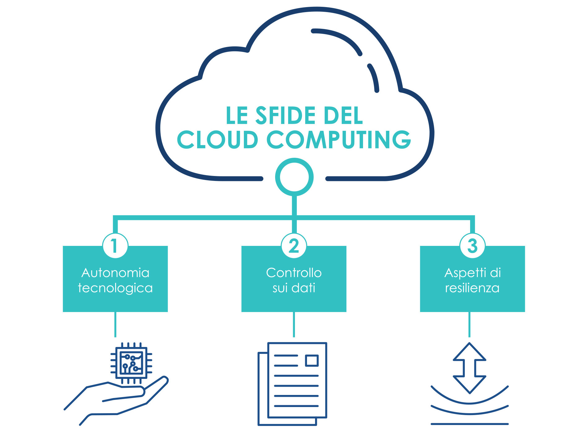

================================================================================
3. Le sfide poste dal Cloud Computing
================================================================================

L’adozione delle nuove tecnologie digitali, e le sfide che ne
conseguono, sono oggetto di importanti regolamentazioni UE quali, tra le
altre, i Regolamenti (UE) 2016/679 e 2018/1807 (c.d. GDPR e libera
circolazione dei dati non personali) e la Direttiva 2016/1148 (c.d.
Direttiva NIS), e di sicurezza nazionale, quali la legge 133/2019 (c.d.
Perimetro di Sicurezza Nazionale Cibernetica, PSNC) [2]_.

3.1 Autonomia Tecnologica
================================================================================

Al fine di governare e gestire i processi di trasformazione digitale del
Paese, come già riconosciuto nella prassi e dalle principali istituzioni
europee, ricopre un’enorme importanza strategica l’autonomia nel
controllo delle infrastrutture digitali del Cloud e conseguentemente
nello stoccaggio e nell’elaborazione dei dati [3]_.

È noto, però, che le quote di mercato delle infrastrutture Cloud delle
aziende europee rappresentano un valore residuale (inferiore al 10%)
rispetto a quelle detenute dalle aziende extra UE [4]_. Tale criticità,
peraltro, non è circoscritta ai soli servizi e piattaforme digitali, ma
anche e soprattutto alle infrastrutture che consentono il funzionamento
degli stessi.

Alla luce di tale posizione di debolezza contrattuale per gli stati
europei, l’adozione massiva di tecnologia Cloud per l’erogazione dei
servizi della PA è soggetta al rischio di modifiche unilaterali delle
condizioni dei servizi forniti, che potrebbero determinare variazioni
significative degli stessi (dall’aumento dei costi di erogazione
all’interruzione del servizio), in ragione di intenti potenzialmente non
controllabili dal Paese. Per questo, il raggiungimento di un’autonomia
tecnologica ha importanti ricadute non solo sulla possibilità di
esercitare un diretto controllo sui dati e sui servizi, ma anche sulla
possibilità di promuovere un ecosistema di tecnologie, indispensabile
per lo sviluppo del Paese (Cloud Computing, IoT, Artificial
Intelligence, Quantum Computing).

3.2 Controllo sui dati
================================================================================

La gestione dei servizi Cloud da parte di fornitori di paesi extra UE
pone un rischio sistemico aggiuntivo dovuto alla normativa in essere in
tali paesi. Come noto, legislazioni extra UE [5]_ possono portare,
previa sussistenza delle previste circostanze, alla richiesta
unilaterale al fornitore dei servizi Cloud di fornire l’accesso ai dati
presenti sui sistemi. Tali fattispecie comportano la possibilità, per
uno Stato estero (o Paese Terzo), di accedere a dati (o flussi di dati)
particolarmente sensibili e strategici per i cittadini e le istituzioni
italiane.

In tale ottica è necessario, nell’ambito della strategia, determinare in
modo chiaro, attraverso una procedura di classificazione, le tipologie
di dati che potranno essere gestiti da un fornitore extra UE attraverso
un Cloud pubblico e quali dati invece avranno bisogno di essere gestiti
da un fornitore Cloud che soddisfi specifici requisiti di sicurezza per
abbattere il rischio che questi dati siano accessibili anche a governi
di Paesi Terzi. La gestione di tali rischi, necessariamente, ha risvolti
non soltanto tecnologici ma anche impatti geopolitici sulla scena
internazionale che dovranno essere opportunamente considerati.

3.3 Aspetti di resilienza
================================================================================

Le infrastrutture e i servizi Cloud che supportano le applicazioni della
PA, e le funzioni essenziali del Paese, dovranno adottare opportuni
accorgimenti, di tipo procedurale e tecnico, di sicurezza, ridondanza e
interoperabilità. Infatti, per innalzare il livello di resilienza nei
confronti di incidenti, quali attacchi cyber e/o guasti tecnici, si
renderà necessaria da un lato l’applicazione di controlli di sicurezza
stratificati (es. pseudoanonimizzazione, cifratura con gestione
on-premise delle chiavi, ecc.) conformi ai requisiti specifici dei dati
trattati, e dall’altro l’introduzione di funzionalità di continuità di
servizio e disaster recovery in siti geograficamente distribuiti sul
territorio nazionale.

In particolare, sebbene le prassi e gli standard tecnici internazionali
siano largamente applicati dai fornitori di servizi Cloud, vista la
criticità dei dati e dei servizi coinvolti, la strategia di migrazione
al Cloud non può prescindere da un processo di *qualificazione dei
fornitori di Cloud pubblico e dei loro servizi*.

Inoltre, la qualificazione non deve limitarsi a valutare gli aspetti di
sicurezza sopra richiamati, ma anche quelli architetturali e
organizzativi, poiché pure questi ultimi possono incidere sulla
resilienza dei servizi forniti, ad esempio, in situazioni di *vendor
lock-in*.

Un’altra importante direzione, in linea con le recenti iniziative e
direttive dell’agenda digitale europea [6]_, è quella della
standardizzazione, dell’armonizzazione e dell’interoperabilità dei
servizi Cloud. In quest’ottica, con il coinvolgimento anche dell’Italia,
è stato avviato il progetto GAIA-X [7]_ con l’obiettivo di sviluppare
requisiti comuni per un’infrastruttura dati europea. Il progetto,
rivolto alle imprese europee, mira a costituire un ecosistema digitale
aperto e resiliente mediante la federazione di servizi Cloud, basati su
standard comuni a garanzia di trasparenza e interoperabilità, in grado
di collegare infrastrutture centralizzate e decentralizzate
trasformandole in un sistema omogeneo.

.. [2]
   Conversione in legge, con modificazioni, del D.L. 21 settembre 2019,
   n. 105, recante disposizioni urgenti in materia di Perimetro di
   Sicurezza Nazionale Cibernetica.

.. [3]
   OECD (2019) Regulation and IRC: challenges posed by the digital
   transformation. 20th meeting of the Regulatory Policy Committee,
   17-18 April 2018, OECD Conference Centre, Paris, France.

.. [4]
   Si veda, ad esempio,
   https://www.gartner.com/en/newsroom/press-releases/2019-07-29-gartner-says-worldwide-iaas-public-cloud-services-market-grew-31point3-percent-in-2018 e
   https://www.idc.com/getdoc.jsp?containerId=prUS45552219 e
   https://www.forbes.com/sites/steveandriole/2019/11/20/forrester-research-gets-cloud--computing-trends-right/#5b30ee4468a2.

.. [5]
   Esempi sono il National Intelligence Law of the People’s Republic of
   China, il Clarifying Lawful Overseas Use of Data Act (CLOUD Act) o il
   Foreign Intelligence Surveillance (FISA).

.. [6]
   https://ec.europa.eu/info/strategy/priorities-2019-2024/europe-fit-digital-age_en

.. [7]
   https://www.data-infrastructure.eu/
