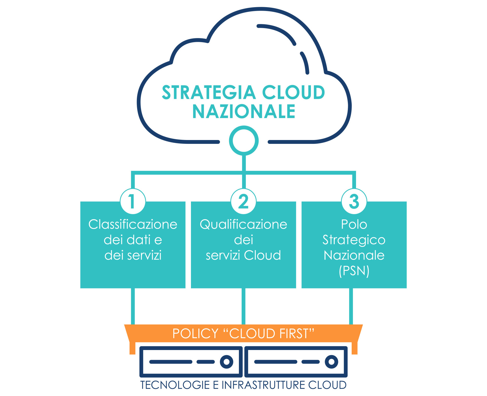

================================================================================
4. La strategia Cloud per la Pubblica Amministrazione
================================================================================

Attualmente, la maggior parte dei servizi pubblici vengono erogati tramite data center della PA che
spesso non possiedono caratteristiche sufficienti per assicurare adeguati standard di affidabilità e
resilienza [8]_. Raggiungere e mantenere tali standard richiede investimenti e competenze che oggi non
sono a disposizione di molte delle pubbliche amministrazioni centrali e locali. La Strategia Cloud Italia
si pone in questo contesto come metodologia implementativa della policy “*Cloud-First*”, pilastro del
progetto di digitalizzazione della PA enunciato nel PNRR italiano. Questa policy permetterà di *guidare,
e favorire l’adozione sicura, controllata e completa delle tecnologie Cloud per la PA*, con l’obiettivo, a
tendere, che tutti i servizi erogati siano basati su applicazioni “*Cloud-native*”, sviluppate cioè nativamente
sulla base dei paradigmi Cloud.

La strategia Cloud per la PA si declina quindi sulla base delle seguenti linee di indirizzo strategico:

1. **Classificazione dei Dati e dei Servizi**: definizione di un processo di classificazione dei dati per guidare 
   e supportare la migrazione dei dati e servizi della PA sul Cloud;

2. **Qualificazione dei Servizi Cloud**: realizzazione di un processo sistematico di scrutinio e qualificazione 
   dei servizi Cloud utilizzabili dalla PA;

3. **Polo Strategico Nazionale**: creazione di un’infrastruttura nazionale per l’erogazione di servizi Cloud, 
   la cui gestione e controllo siano autonomi da soggetti extra UE.

La realizzazione di queste macro-azioni permetterà di armonizzare e regolamentare l’adozione del Cloud
nella PA, nonché applicare economie di scala per favorire una riduzione dei costi di gestione offrendo
servizi digitali più affidabili e resilienti.

4.1 La classificazione dei dati e dei servizi
================================================================================

L’ampio spettro dei servizi Cloud disponibili, alla luce delle sfide tecnologiche e normative presentate,
deve essere adottato in modo regolamentato così da mitigare i rischi sistemici dell’adozione del Cloud.

L’elemento fondamentale per tale regolamentazione è individuare un *processo sistematico di
classificazione dei dati e dei servizi gestiti* dalle PA, il cui risultato possa essere utilizzato per uniformare
e guidare il processo di migrazione al Cloud della PA. Le classi dei dati e servizi sono identificate sulla
base del danno che una loro compromissione, in termini di confidenzialità, integrità e disponibilità,
provocherebbe al sistema Paese. Tali classi sono:

* **Strategico**: dati e servizi la cui compromissione può avere un impatto sulla sicurezza nazionale;

* **Critico**: dati e servizi la cui compromissione potrebbe determinare un pregiudizio al mantenimento di
  funzioni rilevanti per la società, la salute, la sicurezza e il benessere economico e sociale del Paese;

* **Ordinario**: dati e servizi la cui compromissione non provochi l’interruzione di servizi dello Stato o, 
  comunque, un pregiudizio per il benessere economico e sociale del Paese.

Questa classificazione astrae da specifiche normative e requisiti di sicurezza descrivendo esclusivamente
l’impatto per il sistema Paese di una eventuale compromissione di certi dati e servizi. L’applicazione
del processo di classificazione, di seguito definito, permetterà un’analisi guidata degli impatti,
nonché di eventuali requisiti di sicurezza e normativi, per l’identificazione dell’opportuna classe. Ad
esempio, i dati e servizi afferenti funzioni essenziali dello Stato, ovvero identificati nell’ambito del
PSNC, saranno classificati come *strategici*, i dati sanitari dei cittadini saranno classificati come *critici*,
mentre dati e servizi relativi a portali istituzionali delle amministrazioni saranno classificati come *ordinari*.

4.2 La qualificazione dei servizi Cloud
================================================================================

L’acquisizione di servizi Cloud da parte delle pubbliche amministrazioni avviene mediante procedure di
acquisto la cui scarsa flessibilità difficilmente permette di tenere il passo del mercato e, soprattutto, di
valutare gli effettivi rischi tecnici e organizzativi connessi all’adozione di uno specifico servizio.

Nella prospettiva di facilitare e guidare l’implementazione della policy “*Cloud-First*” per la PA, risulta
dirimente offrire un *servizio di qualificazione ex-ante dei servizi Cloud acquistabili dalla PA*. Tale
qualificazione, partendo dall’esperienza maturata da AgID, si pone l’obiettivo di semplificare e
regolamentare, sia dal punto di vista tecnico che amministrativo, l’adozione di servizi Cloud. Alla luce
della classificazione proposta e delle sfide poste dall’adozione del Cloud, la qualificazione dei servizi
Cloud non potrà prescindere dall’analisi dei seguenti aspetti:

1. *gestione operativa* dei servizi Cloud, con dettaglio sugli standard tecnico-organizzativi applicati [9]_ e 
   sulle misure di controllo sui dati;
2. *requisiti di sicurezza* applicati nella gestione dei dati ed erogazione di servizi, quali le modalità di 
   gestione delle chiavi di cifratura e i controlli di sicurezza applicati;
3. *condizioni contrattuali* applicate all’erogazione del servizio (*Service-Level Agreement, SLA*) e alla 
   sua rendicontazione, quali le garanzie di disponibilità e altri strumenti contrattuali a disposizione 
   delle amministrazioni.

Sulla base dell’analisi delle soluzioni tecnologiche e organizzative disponibili sul mercato, i tre aspetti di
analisi permettono di individuare a priori la classificazione dei servizi Cloud riportata di seguito.

* I servizi di *Cloud Pubblico non qualificato* (*extra UE/UE*), ovvero quei servizi che non rispondono ai 
  criteri tecnico-organizzativi e normativi individuati in precedenza.

* I servizi di *Cloud Pubblico qualificato* (*UE*) compatibili con legislazioni rilevanti in materia (es. GDPR 
  e NIS) che consento la localizzazione dei dati in UE e il rispetto di requisiti di sicurezza tecnicoorganizzativi, 
  tipicamente sulla base di sistemi di cifratura granulare gestiti dal fornitore CSP [10]_.

* I servizi di Cloud pubblico con controllo on-premise dei meccanismi di sicurezza, c.d. *Cloud Criptato
  (IT)*, che consentono di incrementare significativamente il livello di controllo sui dati e servizi, 
  introducendo un maggior livello di autonomia dai CSP extra-UE nella gestione operativa e il controllo 
  delle infrastrutture tecnologiche [11]_.

* Soluzioni di Cloud privato e ibrido, infine, permettono la localizzazione dei dati in Italia e maggior 
  isolamento dalle region pubbliche dei principali CSP. Tali garanzie di autonomia sono ottenute
  mediante la gestione operativa da parte di un fornitore soggetto a vigilanza e monitoraggio
  pubblico. Queste implementazioni si possono distinguere tra:

  * soluzioni basate su tecnologia hyperscaler licenziata da uno o più CSP, c.d. *Cloud privato/ibrido 
    “su licenza” (IT)*, oppure

  * soluzioni basate su tecnologie commerciali qualificate mediante procedure di scrutinio e 
    certificazione tecnologica, c.d. *Cloud Privato Qualificato (IT)*.

I servizi Cloud qualificati potranno essere utilizzati, in accordo alla classificazione dei dati, con i seguenti
vincoli:

* le offerte di Cloud Pubblico Qualificato e Criptato, potranno ospitare dati e servizi *ordinari*;

* le offerte di Cloud Criptato, Privato/Ibrido “su licenza“ e Privato Qualificato potranno ospitare dati e servizi *critici*;

* le offerte di Cloud Privato/Ibrido “su licenza“ e Privato Qualificato potranno ospitare dati e servizi *strategici*;

Questo processo di adozione dei servizi Cloud nella PA, dovrà culminare con la realizzazione di un *mercato 
elettronico dei servizi Cloud qualificati* [12]_. Tale mercato dovrà rappresentare il mezzo mediante il quale le
amministrazioni saranno guidate, in accordo al processo di classificazione dei dati e dei servizi, nella
scelta dei servizi Cloud per loro più idonei e all’acquisto diretto con strumenti amministrativi semplificati
e pre-negoziati.

4.3 Il Polo Strategico Nazionale
================================================================================

Lo sviluppo di una nuova infrastruttura informatica a servizio della PA localizzata sul territorio nazionale, il
*Polo Strategico Nazionale (PSN)* [13]_.

Il PSN ha infatti l’obiettivo di dotare la PA di tecnologie e infrastrutture Cloud che possano beneficiare delle
più alte garanzie di affidabilità, resilienza e indipendenza. A tal fine, si prevede che il PSN sia *distribuito
geograficamente* sul territorio nazionale presso siti opportunamente identificati [14]_, al fine di garantire
adeguati livelli di continuità operativa e tolleranza ai guasti. La *gestione operativa* del PSN, sarà affidata
a un fornitore qualificato sulla base di opportuni requisiti tecnico-organizzativi. Il fornitore dovrà garantire
il controllo sui dati in conformità con la normativa in materia, nonché rafforzare la possibilità della PA di
negoziare adeguate condizioni contrattuali con i fornitori di servizi Cloud.

Il PSN dovrà permettere alla PA di garantire, sin dalla progettazione (*by-design*), il rispetto dei requisiti
in materia di sicurezza, ad esempio PSNC e NIS, e di abilitare la migrazione, almeno inizialmente con un
processo *lift-and-shift*, verso tipologie di servizi Cloud IaaS e PaaS.

In accordo alla classificazione fornita nella sezione precedente, il PSN offrirà servizi di *Cloud Criptato (IT)*,
ovvero permetterà di gestire, ad esempio, strumenti di cifratura on-premise integrati su Cloud pubblico
per la PA, e offrirà lo spettro di servizi Cloud privato/ibrido, ovvero il *Cloud Privato/Ibrido “su licenza” (IT)*,
il *Cloud Privato Qualificato (IT)*.

A tendere, l’obiettivo del PSN, in accordo alle procedure di classificazione e qualificazione, è di offrire
supporto alle amministrazioni centrali e alle principali amministrazioni locali, ad esempio Regioni, ASL e
città metropolitane.

.. [8] Dall’ultimo censimento AgID risulta come, ad oggi, il 95% dei circa 11mila data center utilizzati dagli enti
  pubblici italiani presenta carenze nei requisiti minimi di sicurezza, affidabilità, capacità elaborativa ed efficienza.

.. [9] Ad esempio gli standard internazionali ISO 27017/27018, ISO 22301 e CSA STAR.

.. [10] Tali servizi possono includere sistemi di gestione delle chiavi (KMS) realizzati con moduli hardware (HSM).

.. [11] Ad esempio, mediante utilizzo di un HSM on-premise per la gestione delle chiavi utilizzate per la cifratura dei 
  dati sul Cloud Pubblico.

.. [12] Tale proposta è analoga a quanto già realizzato con successo in altre nazioni, ad esempio, il Digital
  Marketplace del Regno Unito https://www.digitalmarketplace.service.gov.uk

.. [13] Così come previsto dall’articolo 33-septies, comma 4, del decreto-legge 18 ottobre 2012, n. 179, convertito,
  con modificazioni, dalla legge 17 dicembre 2012, n. 221.

.. [14] Si pensi, ad esempio, ai livelli di sicurezza fisica dei data center, alla mitigazione del rischio di disastri naturali 
  e all’integrazione con molteplici connettività.