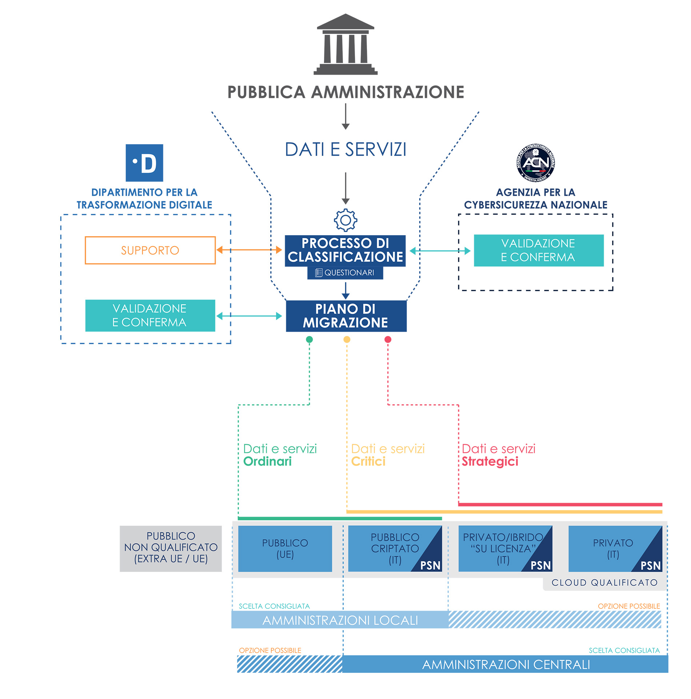

================================================================================
5. La migrazione della Pubblica Amministrazione sul Cloud
================================================================================

La migrazione verso i diversi servizi Cloud qualificati e eventualmente
all’interno del PSN dovrà essere governata tramite un processo
centralizzato, agevole e uniforme per tutte le amministrazioni.

I piani di migrazione saranno quindi definiti in accordo con il
risultato della classificazione dei dati e dei servizi. La
classificazione e la redazione del piano di migrazione saranno definiti
e supportati, per i rispettivi profili di competenza, dell’Agenzia per
la Cybersicurezza Nazionale (ACN) e del Dipartimento per la
Trasformazione Digitale (DTD).

Questo processo non potrà prescindere dalla responsabilizzazione del
soggetto pubblico e permetterà di individuare e catalogare i dati e i
servizi gestiti, applicando poi una categorizzazione rispetto agli
impatti di eventuali compromissioni, dei vincoli normativi e di
sicurezza.

L’esito della classificazione dei dati e servizi da migrare sul Cloud
(ovvero dati strategici, critici o ordinari) permetterà di individuare i
piani di migrazione al Cloud più idonei. Tali piani saranno validati e
confermati dal Dipartimento e dall’Agenzia al fine di assicurare la
congruità e il rispetto delle linee strategiche.

